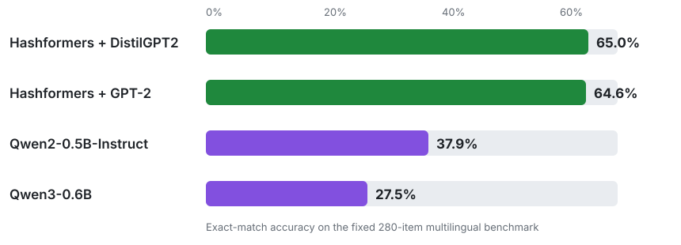

# ✂️ Hashformers

[](https://pypi.org/project/hashformers/)
[](https://pypi.org/project/hashformers/)
[](https://github.com/ruanchaves/hashformers/blob/master/LICENSE)
[](https://github.com/ruanchaves/hashformers)
[](https://colab.research.google.com/github/ruanchaves/hashformers/blob/master/hashformers.ipynb)
[](https://colab.research.google.com/github/ruanchaves/hashformers/blob/master/hashformers_agents_mcp_tutorial.ipynb)

**Fast, local, multilingual hashtag and identifier segmentation using
Transformer language models and beam search.**

- **+37.5 percentage-point accuracy advantage** over Qwen3-0.6B on a
  [fixed 280-item multilingual benchmark](benchmarks/qwen/README.md)
- **14.1 hashtags/second** on a single NVIDIA T4
- Available as a **Python library, spaCy component, MCP server, and Agent Skill**
- Recognized as **state of the art at [LREC 2022](https://aclanthology.org/2022.lrec-1.782/)**

[Quick start](#-quick-start) · [Agent workflows](#mcp-and-agent-skill) ·
[Benchmark](benchmarks/qwen/README.md) ·
[Paper](https://aclanthology.org/2022.lrec-1.782/)

Hashformers uses language models and a beam search algorithm to segment text
without spaces into words. It fills a gap in the NLP ecosystem between
heuristic-based splitters and LLM prompt-based segmentation, and it can use
language models from the [Hugging Face Model Hub](https://huggingface.co/models).

## Benchmark Snapshot

[](benchmarks/qwen/README.md)

On the fixed 280-record benchmark, Hashformers with DistilGPT2 reached 65.0%
exact-match accuracy, exceeding Qwen3-0.6B by **37.5 percentage points**. The
chart compares the published configurations and does not make a general claim
about all LLMs. Hashformers and generative-model throughput measure different
inference paths; see the [full protocol and artifacts](benchmarks/qwen/README.md)
for the scoped interpretation.

---

## 🚀 Quick Start

### Installation

```bash
pip install hashformers
```

Hashformers requires Python 3.10 or newer and supports Transformers 4.46.1
through 5.x.

### Basic Usage

```python
from hashformers import TransformerWordSegmenter as WordSegmenter

ws = WordSegmenter(
    segmenter_model_name_or_path="distilgpt2"
) # You can use any model from the Hugging Face Model Hub

segmentations = ws.segment([
    "#weneedanationalpark",
    "#icecold"
])

print(segmentations)
# ['we need a national park', 'ice cold']
```

For bulk CUDA workloads, opt into adaptive scorer microbatching independently
for beam search and reranking:

```python
ws = WordSegmenter(
    segmenter_model_name_or_path="distilgpt2",
    segmenter_gpu_batch_size="auto",
    segmenter_max_gpu_batch_size=512,
    reranker_model_name_or_path="bert-base-uncased",
    reranker_gpu_batch_size="auto",
    reranker_max_gpu_batch_size=512,
)
```

### MCP and Agent Skill

#### Install the MCP Server

Install and start the optional local MCP server:

```bash
pip install "hashformers[mcp]"
hashformers-mcp \
  --model distilgpt2 \
  --batch-size auto \
  --file-root /path/to/project
```

#### Connect an MCP Client

Add the server to Codex or Claude Code:

```bash
codex mcp add hashformers -- hashformers-mcp --model distilgpt2
claude mcp add --transport stdio --scope user hashformers -- \
  hashformers-mcp --model distilgpt2
```

#### Segment Hashtags Interactively

Ask the agent directly:

> Use Hashformers to segment `#weneedanationalpark` and `#icecold`. Return up
> to three candidates for each hashtag.

#### Process Large Files

For a large text, CSV, or JSON Lines file, authorize its directory when adding
the server:

```bash
codex mcp add hashformers -- hashformers-mcp \
  --model distilgpt2 \
  --file-root /path/to/project
```

Then ask the agent to run the resumable workflow:

> Use Hashformers to segment the hashtags in
> `/path/to/project/hashtags.csv`. Save the results to
> `/path/to/project/segmented.jsonl` and continue until the job is complete.

#### Select a Model for an Unknown Language

If the language is unknown, let the agent sample the file and select a public
Hugging Face model before segmentation:

```bash
codex mcp add hashformers -- hashformers-mcp \
  --defer-model-selection \
  --file-root /path/to/project
```

> Sample `/path/to/project/hashtags.csv`, identify its language, select a
> compatible public Hugging Face model, and segment the file with Hashformers.

#### Install the Agent Skill

The repository includes a `segment-hashtags` Agent Skill. Install it globally
for Codex or Claude Code with:

```bash
mkdir -p ~/.agents/skills ~/.claude/skills
cp -R .agents/skills/segment-hashtags ~/.agents/skills/
cp -R .agents/skills/segment-hashtags ~/.claude/skills/
```

Run `hashformers-mcp --help` for all model, reranker, device, and file-access
options.

### Using Language-Specific Models

```python
# Russian hashtags with RuGPT3
ws = WordSegmenter(
    segmenter_model_name_or_path="ai-forever/rugpt3small_based_on_gpt2"
)

segmentations = ws.segment(["#москвасити"])

print(segmentations)
# ['москва сити']
```

### spaCy Integration

Hashformers can be used as a spaCy pipeline component:

```python
import spacy
import hashformers.spacy  # registers the "hashformers" component

nlp = spacy.blank("en")
nlp.add_pipe("hashformers", config={"model": "distilgpt2"})

doc = nlp("#weneedanationalpark")
print(doc._.segmented)  # "we need a national park"
```

Install with spaCy support:

```bash
pip install hashformers[spacy]
```

## When to Use Hashformers?

Hashformers is designed to perform hashtag segmentation primarily on consumer
GPUs. Its Transformer models often outperform LLMs that can run
locally on GPUs at the same speed and scale, as shown in the
[Qwen benchmark](benchmarks/qwen/README.md). It can be especially useful when
both of the following are true:

- You have access to GPU compute. Even when renting a GPU, our
  [cost projections](benchmarks/qwen/results/2026-08-03-colab-t4-fp16-v3/hosted-api-cost-projection.svg)
  show Hashformers can be cheaper than major LLM providers at volumes of
  roughly 120 hashtags or more.
- Your hashtag segmentation domain is niche enough that heuristic methods such
  as [SymSpell](https://github.com/wolfgarbe/SymSpell),
  [Ekphrasis](https://github.com/cbaziotis/ekphrasis),
  [WordNinja](https://github.com/keredson/wordninja), or
  [Spiral (Ronin)](https://github.com/casics/spiral) are not accurate enough.

Conversely, you may not wish to use Hashformers if:

- Your domain is simple enough for a CPU-based heuristic method.
- You are segmenting a low volume of hashtags, which may not justify using a
  local GPU instead of a major LLM provider.
- You are targeting maximum accuracy at any cost, in which case a cutting-edge
  model from a major LLM provider may be a better fit.

Hashformers therefore sits in the middle ground between heuristic methods and
LLM APIs for users with consumer GPUs.

---

## 📚 Research & Citations

Hashformers was recognized as **state-of-the-art** for hashtag segmentation at [LREC 2022](https://aclanthology.org/2022.lrec-1.782.pdf).

### Papers Using Hashformers

- [Zero-shot hashtag segmentation for multilingual sentiment analysis](https://arxiv.org/abs/2112.03213)

- [HashSet -- A Dataset For Hashtag Segmentation (LREC 2022)](https://aclanthology.org/2022.lrec-1.782/)

- [Generalizability of Abusive Language Detection Models on Homogeneous German Datasets](https://link.springer.com/article/10.1007/s13222-023-00438-1#Fn3) 

- [The problem of varying annotations to identify abusive language in social media content](https://www.cambridge.org/core/journals/natural-language-engineering/article/problem-of-varying-annotations-to-identify-abusive-language-in-social-media-content/B47FCCCEBF6EDF9C628DCC69EC5E0826)

- [NUSS: An R package for mixed N-grams and unigram sequence segmentation](https://www.sciencedirect.com/science/article/pii/S2352711025002754#bbib0017)

- [Hate Speech Detection in Turkish and Arabic Languages: A Comprehensive Study](https://arxiv.org/html/2607.00143v1)

### Citation

If you find **Hashformers** useful, please consider citing our paper:

```bibtex
@misc{rodrigues2021zeroshot,
      title={Zero-shot hashtag segmentation for multilingual sentiment analysis}, 
      author={Ruan Chaves Rodrigues and Marcelo Akira Inuzuka and Juliana Resplande Sant'Anna Gomes and Acquila Santos Rocha and Iacer Calixto and Hugo Alexandre Dantas do Nascimento},
      year={2021},
      eprint={2112.03213},
      archivePrefix={arXiv},
      primaryClass={cs.CL}
}
```

---

## 🤝 Contributing

Pull requests are welcome! [Read our paper](https://arxiv.org/abs/2112.03213) for details on the framework architecture.

```bash
git clone https://github.com/ruanchaves/hashformers.git
cd hashformers
pip install -e .
```

---

## 📖 Resources

- [Qwen and Hashformers Benchmark (August 2026)](benchmarks/qwen/README.md)
- [Hosted LLM API Cost Projections (August 2026)](benchmarks/qwen/results/2026-08-03-colab-t4-fp16-v3/hosted-api-cost-projection.svg)
- [Benchmark Results and Reproducibility Artifacts (August 2026)](benchmarks/qwen/results/2026-08-03-colab-t4-fp16-v3/README.md)
- [15 Datasets for Word Segmentation on the Hugging Face Hub](https://medium.com/@ruanchaves/15-datasets-for-word-segmentation-on-the-hugging-face-hub-4f24cb971e48)
- [Benchmark Scripts](scripts/)
- [Evaluation Report (January 2026)](tutorials/EVALUATION-January_2026.md)
- [Evaluation Report (February 2022)](tutorials/EVALUATION-February_2022.md)


