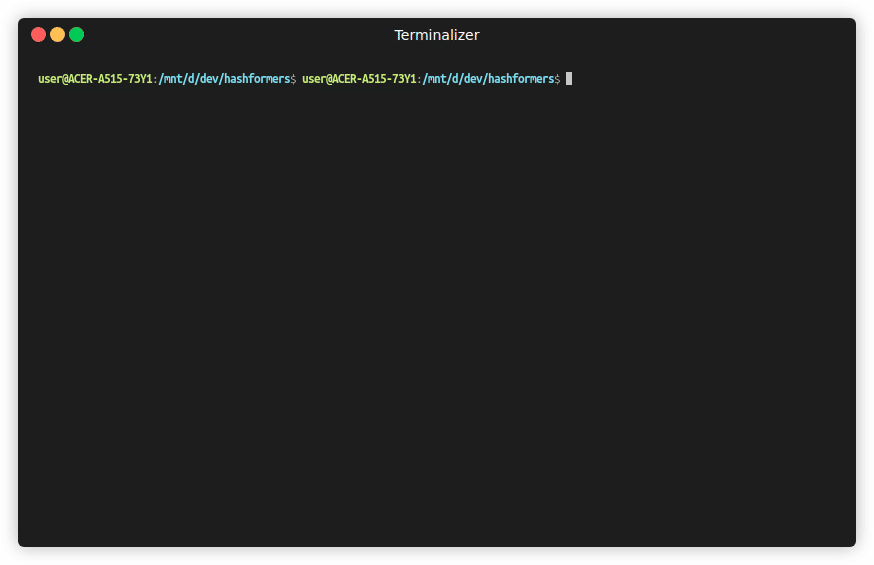

# ✂️ Hashformers

[](https://pypi.org/project/hashformers/)
[](https://pypi.org/project/hashformers/)
[](https://github.com/ruanchaves/hashformers/blob/master/LICENSE)
[](https://github.com/ruanchaves/hashformers)
[](https://colab.research.google.com/github/ruanchaves/hashformers/blob/master/hashformers.ipynb)
[](https://colab.research.google.com/github/ruanchaves/hashformers/blob/master/hashformers_agents_mcp_tutorial.ipynb)

**Fast, local, multilingual hashtag and identifier segmentation using
Transformer language models and beam search.**



- **+37.5 percentage-point accuracy advantage** over Qwen3-0.6B on a
  [fixed 280-item multilingual benchmark](benchmarks/qwen/README.md)
- **14.1 hashtags/second** on a single NVIDIA T4
- Available as a **Python library, spaCy component, MCP server, and Agent Skill**
- Introduced in the [original Hashformers paper](https://arxiv.org/abs/2112.03213)
  and recognized as **state of the art at
  [LREC 2022](https://aclanthology.org/2022.lrec-1.782/)**

[Quick start](#-quick-start) ·
[Colab tutorial](https://colab.research.google.com/github/ruanchaves/hashformers/blob/master/hashformers.ipynb) ·
[Codex + Claude Code MCP Colab tutorial](https://colab.research.google.com/github/ruanchaves/hashformers/blob/master/hashformers_agents_mcp_tutorial.ipynb) ·
[Agent workflows](#mcp-and-agent-skill) ·
[Benchmark](benchmarks/qwen/README.md) ·
[Hashformers paper](https://arxiv.org/abs/2112.03213) ·
[LREC 2022 recognition](https://aclanthology.org/2022.lrec-1.782/)

Hashformers uses language models and a beam search algorithm to segment text
without spaces into words. It fills a gap in the NLP ecosystem between
heuristic-based splitters and LLM prompt-based segmentation, and it can use
language models from the [Hugging Face Model Hub](https://huggingface.co/models).

---

## 🚀 Quick Start

### Installation

```bash
pip install hashformers
```

Hashformers requires Python 3.10 or newer and supports Transformers 4.46.1
through 5.x.

### Basic Usage

```python
from hashformers import TransformerWordSegmenter as WordSegmenter

ws = WordSegmenter(
    segmenter_model_name_or_path="distilgpt2"
) # You can use any model from the Hugging Face Model Hub

segmentations = ws.segment([
    "#weneedanationalpark",
    "#icecold"
])

print(segmentations)
# ['we need a national park', 'ice cold']
```

For bulk CUDA workloads, opt into adaptive scorer microbatching independently
for beam search and reranking:

```python
ws = WordSegmenter(
    segmenter_model_name_or_path="distilgpt2",
    segmenter_gpu_batch_size="auto",
    segmenter_max_gpu_batch_size=512,
    reranker_model_name_or_path="bert-base-uncased",
    reranker_gpu_batch_size="auto",
    reranker_max_gpu_batch_size=512,
)
```

### Reciprocal Rank Fusion

When both a segmenter and reranker are configured, full-list reciprocal rank
fusion (RRF) can combine every candidate instead of using the default legacy
`top2` fusion:

```python
ranked = ws.segment(
    ["#icecold"],
    fusion_method="rrf",
    rrf_k=60,
    fusion_weights={"segmenter": 1.0, "reranker": 2.0},
    return_ranks=True,
)
```

For candidate `c`, Hashformers computes
`RRF(c) = sum(w_i / (rrf_k + rank_i(c)))`. Ranks are one-based competition
ranks within each input, so tied component scores share the same rank. A
candidate missing from one component contributes zero for that component.
Fused ties fall back to the segmenter rank, then reranker rank, then stable
input order.

Hashformers stores `-RRF(c)` because all its public ranking tables use
lower-is-better scores. The defaults are `rrf_k=60` and equal
`segmenter=1.0`, `reranker=1.0` weights. `fusion_method="top2"` remains the
default and continues to use `alpha` and `beta`; RRF only affects selection
when a reranker is present and ensemble selection is active. Requesting RRF
without both raises `ValueError` rather than reporting fusion that did not run.

### MCP and Agent Skill

#### Install the MCP Server

Install and start the optional local MCP server:

```bash
pip install "hashformers[mcp]"
hashformers-mcp \
  --model distilgpt2 \
  --batch-size auto \
  --file-root /path/to/project
```

#### Connect an MCP Client

Add the server to Codex or Claude Code:

```bash
codex mcp add hashformers -- hashformers-mcp --model distilgpt2
claude mcp add --transport stdio --scope user hashformers -- \
  hashformers-mcp --model distilgpt2
```

#### Segment Hashtags Interactively

Ask the agent directly:

> Use Hashformers to segment `#weneedanationalpark` and `#icecold`. Return up
> to three candidates for each hashtag.

To request default RRF through MCP, configure the server with
`--reranker-model` and pass:

```json
{
  "hashtags": ["#weneedanationalpark", "#icecold"],
  "ranking_strategy": "ensemble",
  "fusion_method": "rrf"
}
```

Custom rank damping and weights use the same contract for
`segment_hashtags`, `start_hashtag_file_job`, and `rank_candidates`:

```json
{
  "ranking_strategy": "ensemble",
  "fusion_method": "rrf",
  "rrf_k": 0,
  "fusion_weights": {"segmenter": 1.0, "reranker": 2.0}
}
```

#### Process Large Files

For a large text, CSV, or JSON Lines file, authorize its directory when adding
the server:

```bash
codex mcp add hashformers -- hashformers-mcp \
  --model distilgpt2 \
  --file-root /path/to/project
```

Then ask the agent to run the resumable workflow:

> Use Hashformers to segment the hashtags in
> `/path/to/project/hashtags.csv`. Save the results to
> `/path/to/project/segmented.jsonl` and continue until the job is complete.

#### Select a Model for an Unknown Language

If the language is unknown, let the agent sample the file and select a public
Hugging Face model before segmentation:

```bash
codex mcp add hashformers -- hashformers-mcp \
  --defer-model-selection \
  --file-root /path/to/project
```

> Sample `/path/to/project/hashtags.csv`, identify its language, select a
> compatible public Hugging Face model, and segment the file with Hashformers.

#### Install the Agent Skill

The repository includes a `segment-hashtags` Agent Skill. Install it globally
for Codex or Claude Code with:

```bash
mkdir -p ~/.agents/skills ~/.claude/skills
cp -R .agents/skills/segment-hashtags ~/.agents/skills/
cp -R .agents/skills/segment-hashtags ~/.claude/skills/
```

Run `hashformers-mcp --help` for all model, reranker, device, and file-access
options.

### Using Language-Specific Models

```python
# Russian hashtags with RuGPT3
ws = WordSegmenter(
    segmenter_model_name_or_path="ai-forever/rugpt3small_based_on_gpt2"
)

segmentations = ws.segment(["#москвасити"])

print(segmentations)
# ['москва сити']
```

### spaCy Integration

Hashformers can be used as a spaCy pipeline component:

```python
import spacy
import hashformers.spacy  # registers the "hashformers" component

nlp = spacy.blank("en")
nlp.add_pipe("hashformers", config={"model": "distilgpt2"})

doc = nlp("#weneedanationalpark")
print(doc._.segmented)  # "we need a national park"
```

Install with spaCy support:

```bash
pip install hashformers[spacy]
```

## When to Use Hashformers?

Hashformers occupies the middle ground between CPU heuristics and hosted LLM
APIs: it provides model-backed segmentation while keeping inference local and
scalable on consumer GPUs.

Hashformers is a strong fit when you have access to GPU compute and work in a
niche domain where [SymSpell](https://github.com/wolfgarbe/SymSpell),
[Ekphrasis](https://github.com/cbaziotis/ekphrasis),
[WordNinja](https://github.com/keredson/wordninja), or
[Spiral (Ronin)](https://github.com/casics/spiral) is not accurate enough. The
[cost projections](benchmarks/qwen/results/2026-08-03-colab-t4-fp16-v3/hosted-api-cost-projection.svg)
show that even a rented GPU can become competitive with major LLM providers at
moderate batch sizes.

For simple domains, a CPU heuristic may be the better choice. For low-volume
jobs or maximum accuracy regardless of cost and privacy, a cutting-edge hosted
LLM may be a better fit.

---

## 📚 Research & Citations

Hashformers was recognized as **state-of-the-art** for hashtag segmentation at [LREC 2022](https://aclanthology.org/2022.lrec-1.782.pdf).

### Papers Using Hashformers

- [Zero-shot hashtag segmentation for multilingual sentiment analysis](https://arxiv.org/abs/2112.03213)

- [HashSet -- A Dataset For Hashtag Segmentation (LREC 2022)](https://aclanthology.org/2022.lrec-1.782/)

- [Generalizability of Abusive Language Detection Models on Homogeneous German Datasets](https://link.springer.com/article/10.1007/s13222-023-00438-1#Fn3) 

- [The problem of varying annotations to identify abusive language in social media content](https://www.cambridge.org/core/journals/natural-language-engineering/article/problem-of-varying-annotations-to-identify-abusive-language-in-social-media-content/B47FCCCEBF6EDF9C628DCC69EC5E0826)

- [NUSS: An R package for mixed N-grams and unigram sequence segmentation](https://www.sciencedirect.com/science/article/pii/S2352711025002754#bbib0017)

- [Hate Speech Detection in Turkish and Arabic Languages: A Comprehensive Study](https://arxiv.org/html/2607.00143v1)

### Citation

If you find **Hashformers** useful, please consider citing our paper:

```bibtex
@misc{rodrigues2021zeroshot,
      title={Zero-shot hashtag segmentation for multilingual sentiment analysis}, 
      author={Ruan Chaves Rodrigues and Marcelo Akira Inuzuka and Juliana Resplande Sant'Anna Gomes and Acquila Santos Rocha and Iacer Calixto and Hugo Alexandre Dantas do Nascimento},
      year={2021},
      eprint={2112.03213},
      archivePrefix={arXiv},
      primaryClass={cs.CL}
}
```

---

## 🤝 Contributing

Pull requests are welcome! [Read our paper](https://arxiv.org/abs/2112.03213) for details on the framework architecture.

```bash
git clone https://github.com/ruanchaves/hashformers.git
cd hashformers
pip install -e .
```

---

## 📖 Resources

- [Qwen and Hashformers Benchmark (August 2026)](benchmarks/qwen/README.md)
- [Hosted LLM API Cost Projections (August 2026)](benchmarks/qwen/results/2026-08-03-colab-t4-fp16-v3/hosted-api-cost-projection.svg)
- [Benchmark Results and Reproducibility Artifacts (August 2026)](benchmarks/qwen/results/2026-08-03-colab-t4-fp16-v3/README.md)
- [15 Datasets for Word Segmentation on the Hugging Face Hub](https://medium.com/@ruanchaves/15-datasets-for-word-segmentation-on-the-hugging-face-hub-4f24cb971e48)
- [Benchmark Scripts](scripts/)
- [Evaluation Report (January 2026)](tutorials/EVALUATION-January_2026.md)
- [Evaluation Report (February 2022)](tutorials/EVALUATION-February_2022.md)


