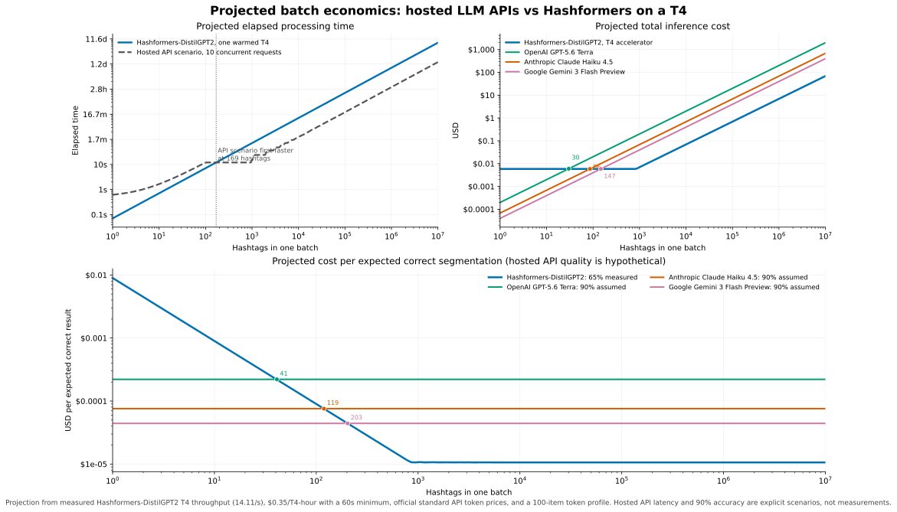

# Fixed-manifest segmentation benchmark

This directory defines the reproducible replacement for the prompted-Qwen
portion of the January 2026 benchmark and a directly comparable rerun of the
Hashformers models from that report. A complete CUDA run is published under
[`results/2026-08-03-colab-t4-fp16-v3`](results/2026-08-03-colab-t4-fp16-v3/),
including fixed sample IDs, raw outputs, run metadata, and cross-method paired
comparisons. The archival January numbers remain separate because they used a
different sample and measurement protocol.

## Model scope

The current baseline is
[`Qwen/Qwen3-0.6B`](https://huggingface.co/Qwen/Qwen3-0.6B) at revision
`c1899de289a04d12100db370d81485cdf75e47ca`, loaded with the text-only
`AutoModelForCausalLM` interface and `enable_thinking=False`. Qwen3-0.6B is the
documented fallback, not the newest Qwen model. It was selected because the
Qwen3.5-0.8B multimodal interface would require a different adapter and makes
excluding its vision components from measurement backend-dependent.

`Qwen/Qwen2-0.5B-Instruct` remains available under the
`qwen2-historical` runner key at revision
`c540970f9e29518b1d8f06ab8b24cba66ad77b6d`. This evaluates the historical
model under the refreshed zero-shot, fixed-manifest protocol; it does not
reproduce the January 2026 five-shot NF4 row. That old run did not save sample
IDs or raw outputs and therefore cannot be given a retrospective confidence
interval or invalid-output rate.

The current Hashformers comparison pins `openai-community/gpt2` at
`607a30d783dfa663caf39e06633721c8d4cfcd7e`, `distilbert/distilgpt2` at
`2290a62682d06624634c1f46a6ad5be0f47f38aa`, and the Russian-only
`ai-forever/rugpt3small_based_on_gpt2` at
`a9307e696cd3c5b7f953ff4cb19d76a4d81821d5`. GPT-2 and DistilGPT2 cover all
280 records. RuGPT3Small is evaluated only on the 20 `ruanchaves/nru_hse`
records because it is a language-specific baseline.

## Published fixed-protocol results

Both models were run on August 3, 2026 from repository revision
`59910585795306ca68aefeeba50b30827ae27d12` in separate processes on one Google
Colab Tesla T4. The checkout was clean for both measurements. The environment
used Python 3.12.13, PyTorch 2.11.0+cu128, Transformers 5.14.1, Accelerate
1.14.0, CUDA runtime 12.8, and NVIDIA driver 580.82.07. Both runs used
unquantized FP16, greedy decoding, batch size one, five warm-up items, CUDA
synchronization, and a 64-token generation ceiling.

| Model | Proposal accuracy (95% Wilson CI) | Strict-output accuracy (95% Wilson CI) | Invalid output | Recovered proposal | Source fallback | Generation latency mean / median / p95 (ms) | Generation throughput (items/s) | Peak allocated / reserved GPU memory (MiB) |
|---|---:|---:|---:|---:|---:|---:|---:|---:|
| Qwen3-0.6B, non-thinking | 27.50% (22.60%–33.01%) | 27.14% (22.27%–32.63%) | 2.50% | 0.36% | 2.14% | 211.57 / 185.76 / 390.74 | 4.73 | 1,164.47 / 1,610 |
| Qwen2-0.5B-Instruct | 37.86% (32.38%–43.67%) | 24.64% (19.96%–30.01%) | 41.79% | 11.07% | 30.71% | 163.95 / 144.80 / 297.28 | 6.10 | 956.22 / 962 |

Wall-clock throughput was 4.70 items/s for Qwen3 and 6.05 items/s for Qwen2.
The paired Qwen3-minus-Qwen2 proposal-accuracy difference was −10.36 percentage
points with a 95% paired percentile-bootstrap interval of −14.64 to −6.07
points. This interval excludes zero in favor of Qwen2 for this configuration
and recovery policy. Neither run used a quote wrapper under the corrected
prompt.

Protocol v3 separates response conformance from the usefulness of a proposed
segmentation. Qwen3 produced one recovered proposal and six source fallbacks;
one fallback was correct. Qwen2 produced 31 recovered proposals, of which 17
were correct, and 86 source fallbacks, of which 20 were correct. Thus invalid
output remains visible and is never presented as strict model compliance, but
it no longer automatically suppresses a usable prediction or force an
incorrect score.

Most valid generations were genuine echoes: 266/273 for Qwen3 and 140/163 for
Qwen2 repeated the input without adding spaces. Only 70/280 manifest records
have a gold output that needs no spaces, so most echoes are ordinary incorrect
segmentations rather than invalid outputs.

The Hashformers runs used repository revision
`d4180e11e383608387685d8f595103adfae8ee72`, top-k 5, five beam-search steps,
no reranker, five warm-up items, and the PR #80 adaptive candidate batch
controller (`gpu_batch_size="auto"`, maximum 512). The controller selected an
effective batch size of 64 for every model with zero OOM backoffs. GPT-2 and
DistilGPT2 reached a converged controller state; the 20-record RuGPT3Small run
ended while still marked `tuning`.

| Hashformers model | Scope | Exact-match accuracy (95% Wilson CI) | Segmentation latency mean / median / p95 (ms) | Segmentation throughput (items/s) | Peak allocated / reserved GPU memory (MiB) |
|---|---:|---:|---:|---:|---:|
| GPT-2 | 280 | 181/280, 64.64% (58.88%–70.01%) | 95.59 / 71.36 / 268.05 | 10.46 | 1,063.50 / 1,998 |
| DistilGPT2 | 280 | 182/280, 65.00% (59.24%–70.35%) | 70.76 / 51.55 / 162.77 | 14.13 | 824.77 / 1,964 |
| RuGPT3Small | 20 Russian | 17/20, 85.00% (63.96%–94.76%) | 78.90 / 59.09 / 160.17 | 12.67 | 726.60 / 988 |

On all 280 paired records, Qwen3 minus GPT-2 was −37.14 percentage points
(95% paired bootstrap CI −43.21 to −31.07), Qwen3 minus DistilGPT2 was −37.50
points (−43.57 to −31.07), Qwen2 minus GPT-2 was −26.79 points (−33.21 to
−20.36), and Qwen2 minus DistilGPT2 was −27.14 points (−33.21 to −21.07).
GPT-2 minus DistilGPT2 was −0.36 points (−3.93 to 3.21). RuGPT3Small's result
and pairwise differences apply only to the 20 Russian records and have much
wider intervals.

This is a comparison of the listed specialized beam-search configurations and
the listed prompted generative configurations under a common exact-match
contract. It does not support a claim about LLMs as a class. Generation and
beam-search latency measure different inference paths and should not be read as
an architecture-independent speed result. See the
[`results` README](results/2026-08-03-colab-t4-fp16-v3/README.md) for artifact
checksums and the committed
[`Colab notebook`](issue_78_qwen_benchmark_colab.ipynb) for the GPU workflow.

## Hosted LLM API cost projection

The following figure is a scenario projection for common hosted providers; it
is not a Qwen comparison or a provider benchmark. Hashformers-DistilGPT2 uses
its measured 14.11 items/s wall throughput and 65.00% exact-match accuracy from
the T4 run above. Provider cost uses standard token list prices retrieved on
August 3, 2026 for
[OpenAI GPT-5.6 Terra](https://developers.openai.com/api/docs/models/compare),
[Anthropic Claude Haiku 4.5](https://www.anthropic.com/claude/haiku), and
[Google Gemini 3 Flash Preview](https://ai.google.dev/gemini-api/docs/pricing?hl=en).



The default scenario assumes 10.81 input and 11.46 output tokens per hashtag,
calibrated from the fixed manifest with compact 100-record JSON requests. API
wall time assumes ten concurrent requests, 0.5 seconds of fixed request
latency, and 100 output tokens/s/request. The illustrative quality calculation
assumes 90% hosted-API exact-match accuracy. Neither API latency nor API
accuracy was measured; the scenario exists to show how conclusions change if
the hosted model is materially more accurate.

Hashformers cost uses the current
[Google Cloud T4 accelerator price](https://cloud.google.com/products/compute/gpus-pricing?hl=en)
of $0.35/hour and the
[one-minute Compute Engine billing minimum](https://cloud.google.com/products/compute/pricing).
It excludes the VM, CPU, memory, storage, network, loading, idle, and operating
costs. For a fresh job, the projected raw-spend crossover occurs at 30 hashtags
versus GPT-5.6 Terra, 86 versus Claude Haiku 4.5, and 147 versus Gemini 3 Flash
Preview. After adjusting for the hypothetical 90% API accuracy versus the
measured 65% Hashformers accuracy, those crossover volumes become 41, 119, and
203. If the T4 is already running and its one-minute minimum is already paid,
Hashformers has the lower marginal inference cost from the first item.

At one million hashtags, the projection is $6.89 and 19.69 GPU-hours for
Hashformers, versus $198.99 for GPT-5.6 Terra, $68.13 for Claude Haiku 4.5, and
$39.80 for Gemini 3 Flash Preview. Under the illustrative ten-request API
concurrency, hosted processing first becomes faster at 169 hashtags and takes
3.32 hours at one million, versus 19.69 hours on one T4. Provider rate limits,
queueing, retries, and network variance can change that result.

All assumptions are editable in
[`hosted_api_cost_scenario.json`](hosted_api_cost_scenario.json). Regenerate the
auditable JSON and SVG with:

```bash
python -m pip install matplotlib
python scripts/segmentation_cost_projection.py
```

## Fixed samples

[`samples.jsonl`](samples.jsonl) commits 20 physical rows from each of the 14
datasets that loaded in the January report: 120 English hashtags, 60 non-English
hashtags, and 100 code identifiers. Every record includes the dataset revision,
split, physical row index, input, gold segmentation, and a stable sample ID.
Its SHA-256 is
`743e7519eb4ef760f45a7b5b6a34fea3b0f7394b85e9fed7609b27864cd8497d`.

Rows are selected independently per dataset by ranking physical indices by
`SHA256("42\\0<dataset>\\0<row-index>")`. This avoids global random state and
makes one dataset's size irrelevant to all other samples. The manifest builder
checks every pinned Hugging Face dataset-repository revision and reproduces the
legacy builders from their original sources:

```bash
python3 scripts/build_qwen_sample_manifest.py --output /tmp/samples.jsonl
cmp benchmarks/qwen/samples.jsonl /tmp/samples.jsonl
```

`hashset_manual` remains excluded because its hosted dataset build failed in
the original evaluation. Changing a dataset pin or any fixed record requires a
reviewed benchmark-version change; it is not routine regeneration.

## Inference protocol

Install a CUDA-compatible PyTorch build, then install the benchmark-only
dependencies. Qwen3 requires Transformers 4.51 or newer.

```bash
python -m pip install 'transformers>=4.51,<6' 'accelerate>=1'
```

Run one model on one explicit device per fresh process from a clean checkout.
Use the same precision and quantization for any new model comparison; the
example uses unquantized FP16 on `cuda:0`. Automatic or multi-device placement
is rejected so synchronization and peak-memory measurements identify one GPU.
Do not compare these measurements with the January 2026 Qwen2 NF4 timing.

```bash
python scripts/qwen_benchmark.py run \
  --model qwen3 \
  --manifest benchmarks/qwen/samples.jsonl \
  --device cuda:0 \
  --precision float16 \
  --quantization none \
  --warmup 5 \
  --output-dir benchmark-results/qwen3-fp16

python scripts/qwen_benchmark.py run \
  --model qwen2-historical \
  --manifest benchmarks/qwen/samples.jsonl \
  --device cuda:0 \
  --precision float16 \
  --quantization none \
  --warmup 5 \
  --output-dir benchmark-results/qwen2-fp16

python scripts/qwen_benchmark.py summarize \
  --predictions benchmark-results/qwen3-fp16/predictions.jsonl \
                benchmark-results/qwen2-fp16/predictions.jsonl \
  --output benchmark-results/qwen-comparison.json
```

Run the Hashformers baselines in separate processes. The default adaptive
candidate batch size is made explicit below; the cap and controller telemetry
are recorded in each run's metadata.

```bash
python scripts/hashformers_benchmark.py run \
  --model gpt2 --device cuda:0 --gpu-batch-size auto \
  --max-gpu-batch-size 512 --output-dir benchmark-results/hashformers-gpt2
python scripts/hashformers_benchmark.py run \
  --model distilgpt2 --device cuda:0 --gpu-batch-size auto \
  --max-gpu-batch-size 512 --output-dir benchmark-results/hashformers-distilgpt2
python scripts/hashformers_benchmark.py run \
  --model rugpt3small --device cuda:0 --gpu-batch-size auto \
  --max-gpu-batch-size 512 --output-dir benchmark-results/hashformers-rugpt3small

python scripts/hashformers_benchmark.py compare \
  --predictions benchmark-results/qwen3-fp16/predictions.jsonl \
                benchmark-results/qwen2-fp16/predictions.jsonl \
                benchmark-results/hashformers-gpt2/predictions.jsonl \
                benchmark-results/hashformers-distilgpt2/predictions.jsonl \
                benchmark-results/hashformers-rugpt3small/predictions.jsonl \
  --output benchmark-results/combined-comparison.json
```

For NF4, install `bitsandbytes` and pass
`--quantization bnb-4bit-nf4`; the artifact records both the requested
quantization and actual parameter dtype. Keep separately configured runs in
separate result tables.

The prompt is zero-shot and identical across task/language groups, uses an
explicit `Input: TEXT` user message, and requests plain text without quotes,
labels, or code fences. This avoids reusing the historical five English
examples for multilingual and code inputs. The Qwen3 chat template receives
`enable_thinking=False`; decoding is greedy and the generation settings are
recorded. A valid semantic response must reproduce every input character, with
the same case and order, and may insert ASCII spaces only. The parser accepts
plain text or one matching pair of ASCII quotes around already-valid content;
the exact raw generation and any accepted wrapper are recorded separately.

Every non-runtime response also produces a proposal. For invalid output, a
bounded candidate may be extracted from a common answer label, one line, a
matching quote envelope, or a code fence. Candidate whitespace and underscores
provide word-boundary signals. A deterministic global edit alignment projects
those boundaries onto the original source when normalized edit distance is at
most 0.5, so recovery never copies a changed, inserted, deleted, or recased
character into the prediction. If no boundary signal can be recovered, the
unchanged input is emitted as an explicit source fallback, matching the legacy
adapter's practical behavior. Primary accuracy scores this proposal; strict
output accuracy, invalid-output rate, recovered-proposal rate, and source-
fallback rate are reported independently.

Each run saves:

- `predictions.jsonl`: stable sample IDs, raw decoded generations, accepted
  response wrappers, strict validity reasons, proposal source/recovery method,
  strict and proposal exact-match outcomes, token counts,
  per-item preprocessing/generation timings, protocol/manifest identity, and
  the model precision, quantization, and resolved device;
- `run_metadata.json`: requested and resolved model/tokenizer revisions,
  generation settings, precision/quantization, package versions, OS/CPU/GPU,
  driver/CUDA metadata, manifest and runner hashes, repository revision and
  dirty state, resolved single-device placement, warm-up IDs, throughput, and
  baseline/peak GPU allocation;
- an optional comparison JSON from `summarize`, containing proposal and strict
  accuracy, invalid/recovery/fallback/wrapper-rate 95% Wilson intervals plus
  paired proposal-accuracy-difference 95%
  percentile-bootstrap intervals (10,000 resamples, seed 42).
The summarizer refuses paired runs whose protocol, manifest hash, sample IDs,
or per-sample provenance differ.

Latency uses batch size one, five unrecorded warm-up items by default, and
synchronizes the explicitly selected CUDA device immediately before and after
`model.generate`. Tokenization is reported separately. Throughput is reported
both over summed generation time and measured wall time. CUDA model-resident
baseline, peak allocated memory, and peak reserved memory are separate fields.
Model loading is intentionally outside the inference peak.

## Publishing a result

Publish refreshed runs in a separate fixed-protocol section. Do not insert them
into the archival January tables. Cross-method exact-match comparisons require
the same manifest, sample provenance, output contract, and clean pinned runs;
the August 2026 artifacts satisfy those conditions for the configurations
listed above.

Commit or publish the complete prediction JSONL, metadata JSON, and generated
comparison JSON. Verify that all 280 sample IDs occur exactly once, metadata
status is `completed` (not `completed-with-errors`), the manifest hash matches
this file, and the model/tokenizer revisions equal their requested pins. Report
the exact model/configuration and its confidence intervals, invalid-output
rate, latency, throughput, and peak memory; do not generalize the result to
prompted models or LLMs as a class.
